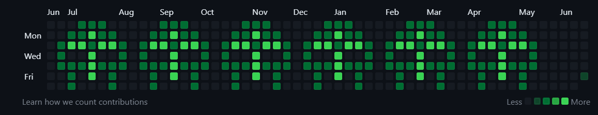

<p align="center">
 
 <h2 align="center">DOOMfiti</h2>
 <p align="center">Make your contributions MF DOOM themed. Just remember, all caps when you spell the man name.</p>
 </br>
</p>
</p>

## Mask Grafitti:
  

# Usage

1. Create a new, empty github repo to store your handiwork.
2. Run `DOOM.py` and follow the prompts for username, art selection, offset, and repo name.
3. Run the generated `DOOM.sh` or `DOOM.ps1` from outside the directory with the generated files (or any non-git tracked dir) and watch it go to work.
4. Wait some more. You'll probably need to wait a day or two for the DOOMfiti to show in your commit graph.

# User Templates

The file format for personal templates is the following:

1. Each template starts off with a ":" and then a name (eg. ":foo")
2. Each line after that is part of a json-recognizable array.
3. The array contain values 0-4, 0 being blank and 4 being dark green.
4. To add multiple templates, just add another name tag as described in 1.

For example:

```
:center-blank
[[1,1,1,1,1,1,1],
[1,1,1,1,1,1,1],
[1,1,1,1,1,1,1],
[1,1,1,0,1,1,1],
[1,1,1,1,1,1,1],
[1,1,1,1,1,1,1],
[1,1,1,1,1,1,1]]
```
This would output a 7 x 7 light green square with a single blank center square.

Once you have a file with templates, enter its name when prompted and the templates will be added to the list of options.


# Removal

Fortunately if you regret your DOOMfiti in the morning, removing it is fairly easy: delete the repo you created for your DOOMfiti (and wait).

# License

DOOMfiti is released under [The MIT license (MIT)](http://opensource.org/licenses/MIT)